<div align="center">
<h1>ClawLoop: Less Harness, More Signal</h1>
<h2>Verifiable Reinforcement Learning for Long-Horizon Tool-Using Agents</h2>

[](paper/clawAgent_main.pdf)
[](https://huggingface.co/datasets/clawLooop/clawloop-data)
[](verl/)
[](LICENSE)
</div>

<br>

## 1. Overview

ClawLoop is a lightweight, verifiable reinforcement-learning framework for long-horizon agents that solve tasks by reading and modifying files through tools. It accompanies the paper *Less Harness, More Signal: Efficient In-Harness RL for Autonomous Agents* and releases the complete modified VERL source tree, the 6,970-task corpus, the paper artifacts, and the training launchers in one repository.

The design follows one narrow learning contract:

```text
task specification → isolated workspace → atomic actions
        ↑                                      ↓
terminal verifier ← multi-turn observations and actions
```

The policy is rewarded for the terminal state it creates rather than for reproducing a prescribed tool trajectory. Each rollout receives its own workspace, interacts through a small guarded tool surface, and is scored by a verifier after the episode. Product-layer services that do not improve the policy signal—session management, plugin registries, long-term memory, and external orchestration—are outside the critical path.

The release also integrates **Asymmetric Advantage Masking (AAM)** into VERL. AAM detects deterministic ineffective turns and removes their *positive* policy-gradient contribution while preserving their negative learning signal. Together, ClawLoop and AAM address the two bottlenecks identified in the paper:

| Bottleneck | Observation | Release-level response |
| --- | --- | --- |
| Environment overhead | CPU/IO-bound product harness work leaves the accelerator idle. | ClawLoop keeps only workspace construction, atomic tools, observations, and terminal verification. |
| Credit misassignment | GRPO broadcasts one trajectory-level advantage to useful and ineffective tokens alike. | AAM applies a token-level, advantage-asymmetric actor mask. |

The dataset is available directly on the Hugging Face Hub: **[clawLooop/clawloop-data](https://huggingface.co/datasets/clawLooop/clawloop-data)**. The repository mirror contains the same JSONL release through Git LFS.

## 2. Contents

| Section | What to find here |
| --- | --- |
| [1. Overview](#1-overview) | Research goal, central idea, and headline findings. |
| [2. Contents](#2-contents) | This repository guide. |
| [3. Project structure](#3-project-structure) | The GitHub tree and the role of each directory. |
| [4. Main components](#4-main-components) | The ClawLoop framework and the AAM method. |
| [5. Training process and figure record](#5-training-process-and-figure-record) | Rollout/training lifecycle and all directly rendered paper figures. |
| [6. Results](#6-results) | In-domain, out-of-domain, ablation, systems, and inference results. |
| [Reproduction](#reproduction) | Dataset preparation, installation, and 9B/27B launch commands. |
| [Safety and licensing](#safety-and-licensing) | Execution boundary, upstream licenses, and artifact notices. |

## 3. Project structure

The repository is intentionally self-contained. `verl/` is not a patch bundle or a recipe submodule: it is the complete modified VERL checkout with ClawLoop and AAM already integrated.

```text
clawloop/
├── README.md                         # This project guide
├── LICENSE                           # ClawLoop release license
├── THIRD_PARTY_NOTICES.md            # VERL, AAAI, and benchmark notices
├── .gitattributes                    # Git LFS rule for the JSONL corpus
├── requirements-data.txt             # Lightweight data-validation dependencies
├── data/
│   ├── tasks.jsonl                   # 6,970 validated task records (Git LFS)
│   ├── metadata.json                 # Export counts and validation metadata
│   ├── SCHEMA.md                     # Record schema and restoration contract
│   ├── tasks.part1.rar               # Original task archive part 1
│   └── tasks.part2.rar               # Original task archive part 2
├── paper/
│   ├── clawAgent_main.pdf            # Manuscript PDF
│   ├── figure1.pdf                   # Architecture figure
│   ├── grpo_three_figures_combined.pdf
│   ├── fig_cost.pdf                  # Environment/training cost figure
│   ├── fig_train_eff.pdf             # Training efficiency figure
│   ├── fig_token_sr.pdf              # Success/token-efficiency figure
│   ├── previews/                     # PNG previews for GitHub rendering
│   ├── main.tex, appdx.tex           # Manuscript sources
│   └── *.bib, *.bst, *.sty           # Bibliography and style files
├── scripts/
│   ├── validate_release.py           # Static release validation
│   ├── restore_hf_dataset.py         # JSONL → runnable task layout
│   └── prepare_hf_dataset.py         # Task layout → JSONL export
└── verl/                             # Complete modified VERL source tree
    ├── verl/                         # Trainer, rollout, agent-loop integration
    ├── nanoclaw_recipe/              # ClawLoop runtime, tools, AAM, launchers
    ├── tests/recipe/nanoclaw/        # Regression tests for the integration
    ├── examples/ and docs/           # Upstream VERL examples and documentation
    ├── nanoclaw_recipe/train_9b.sh   # Qwen3.5-9B reference launch
    └── nanoclaw_recipe/train_27b.sh  # Qwen3.5-27B reference launch
```

The internal package directory retains the historical `nanoclaw_recipe` name for compatibility with the integrated code. **ClawLoop** is the formal public project name; no separate `patches/` or external `recipe/` directory is required.

## 4. Main components

### 4.1 ClawLoop framework

ClawLoop is a training-oriented workspace harness. A task record supplies a prompt, an environment builder, and a verifier. The builder creates the initial files in a disposable per-rollout workspace; the agent then explores and edits that workspace through guarded tools; the verifier inspects the final state and emits the reward.

| Component | Role in a rollout | Source anchor |
| --- | --- | --- |
| Task bundle | Resolves prompts, builders, verifiers, manifests, and flat/legacy layouts. | [`common.py`](verl/nanoclaw_recipe/common.py) |
| Workspace initializer | Creates a unique workspace and runs the builder in an isolated subprocess. | [`nanoclaw.py`](verl/nanoclaw_recipe/nanoclaw.py) |
| Atomic tools | Lists, reads, searches, writes, edits, creates directories, and runs restricted shell commands. | [`runtime/tools.py`](verl/nanoclaw_recipe/runtime/tools.py) |
| Multi-turn agent loop | Interleaves model reasoning, tool calls, observations, and response masks. | [`nanoclaw_support.py`](verl/verl/experimental/agent_loop/nanoclaw_support.py) |
| Terminal verifier | Scores the resulting workspace after generation; it is not exposed as an agent action. | `workplace_verifier.py` in each task bundle |
| VERL trainer path | Batches rollouts, computes GRPO advantages, applies the actor loss mask, and updates the policy. | [`ray_trainer.py`](verl/verl/trainer/ppo/ray_trainer.py) |

The safety boundary is explicit:

| Tool group | Operations | Runtime guard |
| --- | --- | --- |
| Inspect | `list_dir`, `read_file`, `grep`, `find` | Relative paths and bounded output. |
| Modify | `write_file`, `edit_file`, `apply_patch`, `mkdir` | Workspace-only resolution; parent traversal is rejected. |
| Compute | Restricted `bash` with allowlisted utilities | No background jobs, command substitution, unsupported redirection, or dangerous Python patterns. |
| Judge | `workplace_verifier.py` | Separate subprocess with isolated `HOME`/`TMPDIR` and a configurable timeout. |

The environment builder has a 120-second default timeout; verifier execution has a 300-second default timeout. Builder and verifier output is captured, score files are checked in the expected locations, and failed or missing verifiers receive an explicit fallback status. Memory operations and product-runtime state are not part of the local learning loop.

### 4.2 Asymmetric Advantage Masking (AAM)

In standard GRPO, all policy-generated tokens in a sampled trajectory inherit the same standardized group advantage. A successful episode can therefore reinforce a useful edit together with redundant reads, repeated tool results, error calls, internal loops, or a truncated final response.

AAM records candidate ineffective spans during rollout and applies the advantage condition after GRPO computes the trajectory advantage. With `m_base` as the ordinary response mask, `B` as the detected bad-turn spans, and `A_t` as the trajectory advantage:

```text
m_t = m_base_t × [1 − 1(t ∈ B and A_t > 0)]
```

| Advantage | Ineffective token | AAM behavior |
| --- | --- | --- |
| Positive | Yes | Mask its positive actor-gradient contribution. |
| Negative | Yes | Keep it active so the policy learns to avoid the behavior. |
| Either | No | Keep the ordinary response mask unchanged. |
| Either | Verifier/reward | Never alter the terminal reward or the rollout context. |

The current detector covers four deterministic patterns: looping responses, duplicate tool-result turns, error tool results, and a final assistant turn cut off by the response budget. This asymmetry matters: the paper's ablation shows that symmetric masking loses 6.30 success-rate points and random masking loses 5.50 points relative to full AAM.

## 5. Training process and figure record

### 5.1 End-to-end training lifecycle

```mermaid
flowchart LR
    A[Task JSONL] --> B[Dataset resolver]
    B --> C[Per-rollout workspace]
    C --> D[env_builder.py]
    D --> E[Initial files]
    E --> F[Qwen3.5 multi-turn policy]
    F <--> G[Guarded atomic tools]
    G --> H[Workspace after rollout]
    H --> I[workplace_verifier.py]
    I --> J[Terminal reward]
    J --> K[GRPO group advantage]
    K --> L[AAM token mask]
    L --> M[VERL actor update]
    M --> F
```



| Stage | What happens | What is learned |
| --- | --- | --- |
| 1. Discover | `CustomRLHFDataset` loads the prompt and task bundle; rows can be replicated for a GRPO group without creating workspaces. | No environment side effect. |
| 2. Initialize | `NanoclawWorkspaceTool` creates a unique directory and runs `env_builder.py`. | Independent state for every sampled trajectory. |
| 3. Act | The policy alternates assistant turns and tool observations for up to the configured turn/token budget. | Candidate ineffective spans and assistant-token masks are recorded. |
| 4. Verify | `compute_score` runs the terminal verifier and reads the score artifact. | Reward reflects the final workspace, not a fixed action trace or final prose. |
| 5. Update | VERL forms the group advantage; AAM suppresses only positive credit on detected bad spans. | Useful edits are reinforced while negative feedback remains available. |

### 5.2 Training figures

The figures below are taken directly from the paper and are included here with captions that explain the corresponding experimental finding.

#### Figure 1 — ClawLoop architecture


The architecture keeps the task specification, isolated mutable workspace, atomic tools, multi-turn observations, and terminal verifier inside the policy-gradient loop. Session management, plugin discovery, long-term memory, and external service orchestration are removed from the learning-critical path.

#### Figure 2 — GRPO training dynamics and credit misassignment


#### Figure 3 — Environment and training efficiency


The controlled comparison isolates the systems bottleneck. Product-harness GRPO spends 64.5 seconds per episode in environment execution, while ClawLoop reduces this to 7.3 seconds; adding AAM reduces it further to 6.9 seconds by suppressing wasteful turns. Mean GPU utilization rises from 14% to 33% with ClawLoop + GRPO and to 49% with ClawLoop + AAM.


#### Figure 4 — Inference success versus token consumption


The inference plot measures whether the training improvement also changes behavior at test time. AAM-trained models move toward higher success with fewer generated tokens. At 27B, the paper reports 66.4% success with 5.7K tokens per episode, close to the 67.2% success reported for GPT-5 while using substantially fewer generated tokens.

#### Figure 5 — Manuscript and supplementary visual record


The repository also includes the manuscript preview and every source figure used in the paper: [`paper/`](paper/), including `fig_cost2.png`, both GRPO exports, the harness draft, and the PNG preview directory. The PDFs remain available for printing and camera-ready inspection.

## 6. Results

All benchmark values below are transcribed from the manuscript tables. Unless noted otherwise, they are success rates in percent, reported as mean ± standard deviation over three random seeds. `Base` is the untuned Qwen3.5 model, `+ GRPO` is standard GRPO on ClawLoop, and `+ AAM (ours)` is the proposed training method.

### 6.1 In-domain Claw-style benchmarks

These benchmarks share the workspace-and-tool interaction format used during training. AAM improves over standard GRPO on every reported Qwen3.5-9B benchmark and at every listed scale.

| Method | PinchBench | ClawEval | ClawBenchPro |
| --- | ---: | ---: | ---: |
| Kimi-2.5 | 54.60 | 66.60 | 73.00 |
| Claude-4.6-Opus | 69.90 | 80.60 | 92.30 |
| GPT-5.4 | 75.70 | 78.30 | 93.70 |
| MiniMax-m2.7 | 65.40 | 71.80 | 78.20 |
| Nemotron3Super | 42.20 | 41.70 | 46.50 |
| Qwen3.5-9B Base | 49.40 ± 0.4 | 65.20 ± 0.3 | 88.00 ± 0.2 |
| Qwen3.5-9B + GRPO | 52.10 ± 0.3 | 67.50 ± 0.5 | 90.10 ± 0.2 |
| **Qwen3.5-9B + AAM (ours)** | **57.20 ± 0.2** | **71.60 ± 0.4** | **93.60 ± 0.1** |

The 9B AAM gain over standard GRPO is +5.10 on PinchBench, +4.10 on ClawEval, and +3.50 on ClawBenchPro. The paper emphasizes that the largest gains occur on longer, more compositional episodes where ineffective turns have more opportunities to receive accidental positive credit.

#### Scale comparison with AAM

| Model / method | PinchBench | ClawEval | ClawBenchPro |
| --- | ---: | ---: | ---: |
| Qwen3.5-2B | 26.80 ± 0.5 | 29.10 ± 0.6 | 63.70 ± 0.4 |
| Qwen3.5-2B + AAM | **41.80 ± 0.3** | **50.40 ± 0.4** | **73.70 ± 0.3** |
| Qwen3.5-4B | 37.10 ± 0.4 | 58.90 ± 0.3 | 87.60 ± 0.3 |
| Qwen3.5-4B + AAM | **50.80 ± 0.2** | **72.40 ± 0.3** | **91.10 ± 0.2** |
| Qwen3.5-27B | 52.04 ± 0.3 | 72.30 ± 0.2 | 93.60 ± 0.1 |
| Qwen3.5-27B + AAM | **57.54 ± 0.2** | **75.80 ± 0.3** | **95.80 ± 0.1** |

At 27B, AAM reaches 95.80% on ClawBenchPro, above the reported GPT-5.4 value of 93.70% on that benchmark. This is a result for the specified evaluation protocol and should not be interpreted as a universal ranking across harnesses.

### 6.2 Out-of-domain tool-use benchmarks

BFCL-v3 and τ²-bench use different tool schemas and dialogue protocols, and no tasks from either benchmark are included in the released training corpus. The transfer therefore tests whether AAM improves general multi-turn planning and error recovery rather than format memorization.

| Method | BFCL-v3 Overall | τ² Retail | τ² Airline | τ² Telecom |
| --- | ---: | ---: | ---: | ---: |
| Gemini-3-Pro | 60.75 | 75.90 | 80.50 | 91.00 |
| Claude Sonnet 4.5 | 61.37 | 72.40 | 72.00 | 84.90 |
| Qwen3-235B-Think | 42.75 | 71.90 | 58.60 | 47.30 |
| Kimi-K2-Instruct | 45.88 | 70.60 | 56.50 | 65.80 |
| Qwen3.5-9B Base | 44.00 ± 0.4 | 35.14 ± 0.3 | 32.00 ± 0.5 | 15.79 ± 0.2 |
| Qwen3.5-9B + GRPO | 45.60 ± 0.3 | 36.18 ± 0.4 | 34.00 ± 0.3 | 17.93 ± 0.2 |
| **Qwen3.5-9B + AAM (ours)** | **48.75 ± 0.2** | **38.23 ± 0.3** | **37.94 ± 0.2** | **22.15 ± 0.1** |

#### Scale comparison with AAM

| Model / method | BFCL-v3 Overall | τ² Retail | τ² Airline | τ² Telecom |
| --- | ---: | ---: | ---: | ---: |
| Qwen3.5-2B | 31.50 ± 0.5 | 25.44 ± 0.4 | 16.00 ± 0.6 | 35.96 ± 0.5 |
| Qwen3.5-2B + AAM | **40.50 ± 0.3** | **31.30 ± 0.3** | **27.25 ± 0.4** | **48.01 ± 0.3** |
| Qwen3.5-4B | 44.25 ± 0.4 | 38.60 ± 0.3 | 30.00 ± 0.3 | 49.12 ± 0.4 |
| Qwen3.5-4B + AAM | **48.50 ± 0.2** | **41.37 ± 0.2** | **35.31 ± 0.2** | **54.81 ± 0.2** |
| Qwen3.5-27B | 61.00 ± 0.3 | 64.91 ± 0.2 | 72.00 ± 0.3 | 73.68 ± 0.2 |
| Qwen3.5-27B + AAM | **64.50 ± 0.1** | **67.19 ± 0.2** | **76.38 ± 0.1** | **78.37 ± 0.1** |

The 9B AAM improvement over standard GRPO is +3.15 points on BFCL-v3 and +3.33 points on τ²-bench Overall when the paper's aggregate comparison is used. Gains are especially visible on the longer Airline and Telecom domains.

### 6.3 AAM ablation

The ablation is on Qwen3.5-9B and reports average in-domain success rate across the three Claw-style benchmarks.

| Variant | Average SR (%) | Change vs. full AAM |
| --- | ---: | ---: |
| **AAM (full)** | **57.20** | — |
| without looping mask | 56.90 | −0.30 |
| without redundant-action mask | 53.10 | −4.10 |
| without truncation mask | 56.80 | −0.40 |
| without error mask | 53.40 | −3.80 |
| Symmetric masking | 50.90 | −6.30 |
| Random masking | 51.70 | −5.50 |

The result separates two effects. First, redundant actions and tool errors are the most damaging ineffective-turn classes. Second, the advantage asymmetry is essential: preserving negative gradients lets the model learn avoidance, whereas always zeroing the same spans discards useful failure information.

### 6.4 Systems and inference efficiency

| Quantity | Product harness / baseline | ClawLoop + GRPO | ClawLoop + AAM |
| --- | ---: | ---: | ---: |
| Training episode time | 64.5 s | 7.3 s | 6.9 s |
| Mean GPU utilization | 14% | 33% | 49% |
| Environment-side speedup | 1× | 8.8× | — |
| Qwen3.5-27B inference | — | — | 66.4% SR at 5.7K tokens/episode |

The paper's central systems conclusion is that removing product-runtime overhead supplies the dominant throughput gain, while AAM further shortens trajectories and improves utilization by preventing wasteful behavior from being reinforced. At inference time, the 27B AAM model reaches 66.4% success with 5.7K tokens per episode, compared with the reported GPT-5 reference of 67.2%.

## Reproduction

### Dataset

The release contains 6,970 valid task records from a 7,056-record source export. Each record includes `task_id`, `prompt`, `task_yaml`, `env_builder`, `verifier`, a validation manifest, and canonical source-file fields. All released records pass the strict export checks and environment-builder smoke tests.

For Hub-native loading:

```python
from datasets import load_dataset

tasks = load_dataset("clawLooop/clawloop-data", split="train")
```

For local restoration:

```bash
git lfs install
python scripts/validate_release.py data/tasks.jsonl
python scripts/restore_hf_dataset.py \
  data/tasks.jsonl \
  --output-dir /tmp/clawloop_tasks
```

The restore script writes files only; it does not import or execute task builders or verifiers. To regenerate JSONL from a restored task tree:

```bash
python scripts/prepare_hf_dataset.py \
  /path/to/restored_data_all \
  data/tasks.jsonl
```

### Install the integrated VERL tree

```bash
cd /path/to/clawloop/verl
pip install -e .
```

No patch application, external recipe checkout, or `VERL_ROOT` variable is required. The complete framework and ClawLoop integration are already present under `verl/`.

### Train with the reference 9B and 27B profiles

```bash
cd /path/to/clawloop/verl
BASE_TASKS=/tmp/clawloop_tasks \
MODEL_PATH=/path/to/Qwen3.5-9B \
bash nanoclaw_recipe/train_9b.sh
```

```bash
cd /path/to/clawloop/verl
BASE_TASKS=/tmp/clawloop_tasks \
MODEL_PATH=/path/to/Qwen3.5-27B \
bash nanoclaw_recipe/train_27b.sh
```

The reference profiles use the paper-aligned multi-turn setup: 8,192 prompt tokens, 22,768 response tokens, 16,384 assistant tokens, 8,192 tool-observation tokens, 35 turns, FSDP2, asynchronous vLLM rollout, Qwen3-Coder formatting, GRPO, eight responses per prompt, and AAM enabled. Hardware-specific paths and Hydra overrides can be supplied through environment variables or command-line arguments.

Regression tests for masking and final-answer behavior are in [`verl/tests/recipe/nanoclaw/`](verl/tests/recipe/nanoclaw/).

## Safety and licensing

Environment builders and verifiers are benchmark code and should be run only in a disposable container with network isolation, resource limits, and a temporary filesystem. The validator reports eight absolute-path warnings inherited from synthetic task content; these are fixture examples, not paths used by release tooling.

ClawLoop-specific code and documentation are MIT licensed. VERL-derived files remain subject to the upstream Apache-2.0 license. AAAI author-kit files and source benchmark exports may carry additional redistribution terms; review [`THIRD_PARTY_NOTICES.md`](THIRD_PARTY_NOTICES.md) before redistributing the repository.

## Citation

```bibtex
@article{clawloop2026,
  title = {Less Harness, More Signal: Efficient In-Harness RL for Autonomous Agents},
  year  = {2026},
  note  = {ClawLoop release; manuscript source and task dataset included}
}
```
