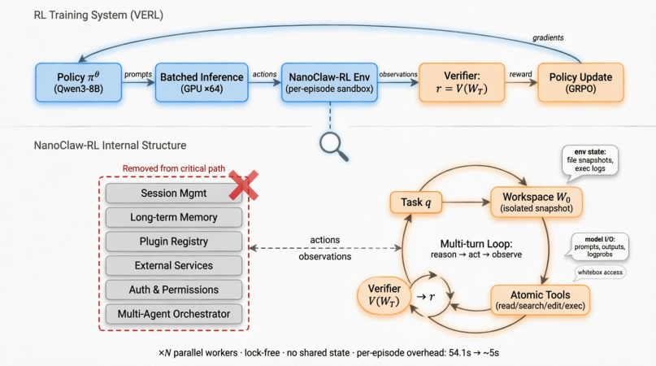
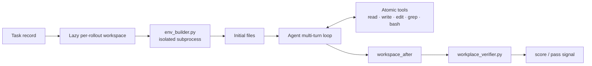
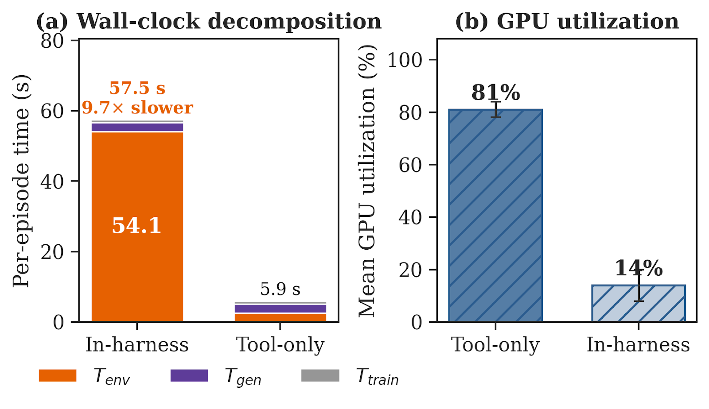
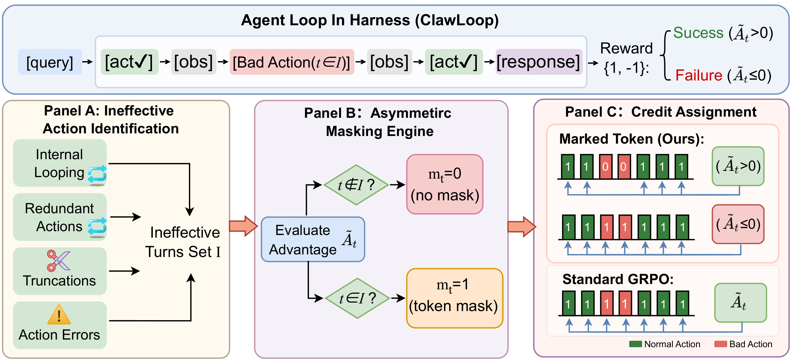
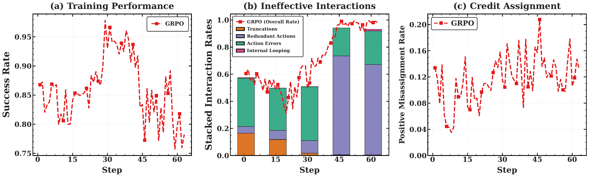
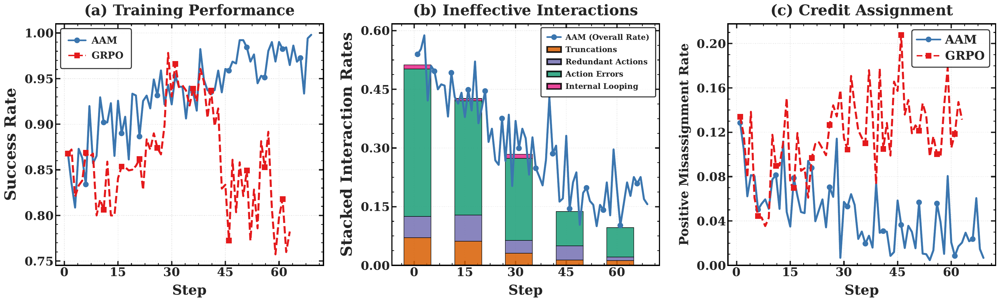
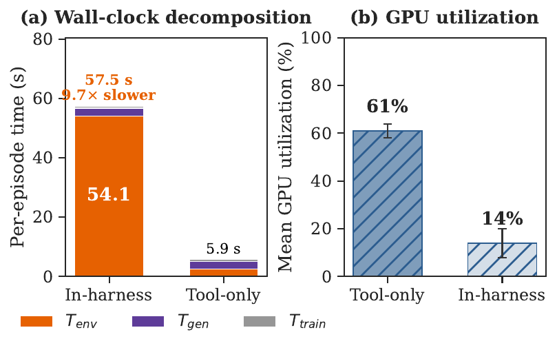
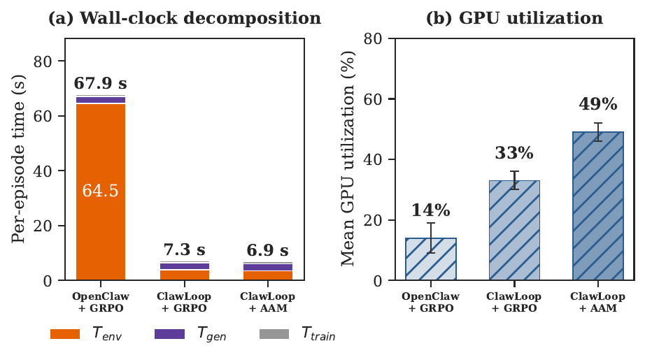
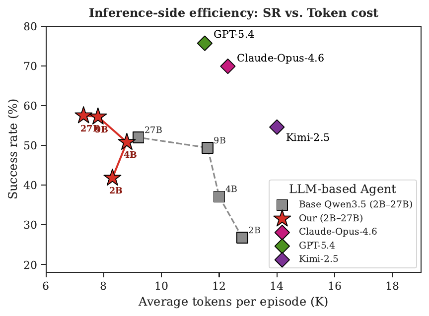

<div align="center">
<h1>ClawLoop: Less Harness, More Signal</h1>
<h2>Verifiable Reinforcement Learning for Long-Horizon Tool-Using Agents</h2>

[](paper/clawAgent_main.pdf)
[](data/tasks.jsonl)
[](https://huggingface.co/datasets/clawLooop/clawloop-data)
[](recipe/README.md)
[](LICENSE)
</div>

<br>

**News!!!**

- [2026/09] We release the ClawLoop task corpus, ClawLoop recipe, AAM integration, paper artifacts, and portable Qwen3.5-9B/27B launch profiles.
- [2026/09] The JSONL release contains 6,970 tasks that passed strict export validation and environment-builder smoke tests.
- [2026/09] The README includes directly rendered PNG previews, with the full-resolution PDF figures preserved beside them.

## Less Harness, More Signal

ClawLoop is a research release for **verifiable reinforcement learning of long-horizon, tool-using agents**. It accompanies the paper *Less Harness, More Signal: Efficient In-Harness RL for Autonomous Agents* and packages the task corpus, execution recipe, masking implementation, and reproducibility materials in one Hub-ready project.

The central premise is simple: an agent should be trained against the **state it creates**, not against a single prescribed tool trajectory. Every rollout therefore runs in an isolated workspace, uses a small set of general file and shell tools, and receives reward from a verifier that inspects the terminal workspace. Search order, edits, retries, and recovery remain open to the policy.



*ClawLoop keeps the task, isolated workspace, atomic tools, multi-turn interaction, and terminal verifier in the policy-gradient loop while removing product-layer state such as session management, plugin registries, and long-term memory.*

## The ClawLoop environment

ClawLoop is a **verifiable workspace loop**, not a product-runtime clone. The policy edits an isolated workspace through a small tool surface; only the terminal workspace is passed to the verifier.



### Rollout lifecycle

| Stage | Source-level behavior | Learning boundary |
| --- | --- | --- |
| 1 · Discover | `CustomRLHFDataset` resolves prompt, builder, and verifier from legacy or flat task layouts. | No workspace is created while dataset rows are replicated for GRPO. |
| 2 · Initialize | `NanoclawWorkspaceTool` creates a unique result directory and runs `env_builder.py` in it. | Each sampled trajectory receives independent state. |
| 3 · Act | The model performs multi-turn tool calls; observations are appended to the trajectory and logged in `tool_events.jsonl`. | Only assistant-generated tokens receive policy-gradient updates. |
| 4 · Verify | `compute_score` runs `workplace_verifier.py` after generation and reads `workplace_score.json`. | Reward is derived from terminal state, not final prose or a fixed action trace. |
| 5 · Finalize | Runtime metadata is written; temporary files are removed by default. | Failed rollouts do not contaminate other samples. |

### Tool surface and safety boundary

| Tool group | Operations | Guardrail |
| --- | --- | --- |
| Inspect | `list_dir`, `read_file`, `grep`, `find` | Relative paths only; bounded output. |
| Modify | `write_file`, `edit_file`, `apply_patch`, `mkdir` | Writes resolve inside the workspace; parent traversal (`..`) is rejected. |
| Compute | Restricted `bash` (`python`, `grep`, `awk`, `sed`, `sort`, etc.) | Allowlisted commands; no background jobs, command substitution, unsupported redirection, or dangerous Python patterns. |
| Judge | `workplace_verifier.py` (not exposed as an agent tool) | Separate subprocess, isolated `HOME`/`TMPDIR`, configurable timeout (300 s by default). |

The environment setup subprocess has a 120 s default timeout. Verifier and builder outputs are captured, score files are checked in both the workspace and verifier directory, and missing or failed verifiers receive an explicit fallback status. Memory operations are disabled in the local runner.

### What “lightweight” removes

| Kept in the learning loop | Removed from the critical path |
| --- | --- |
| Task prompt and files | Session management |
| Isolated workspace snapshots | Plugin registry |
| Atomic file/shell tools | Long-term memory |
| Multi-turn observations | External service orchestration |
| Terminal-state verifier | Authentication and multi-agent coordination |

This narrow contract—**task specification → isolated state → atomic actions → terminal verification**—is the systems reason ClawLoop reduces environment overhead while preserving inspectable, state-based rewards.

Implementation anchors: [`nanoclaw.py`](recipe/nanoclaw_recipe/nanoclaw.py) (VERL tool and reward boundary), [`common.py`](recipe/nanoclaw_recipe/common.py) (task discovery and bundle handling), [`runtime/tools.py`](recipe/nanoclaw_recipe/runtime/tools.py) (path and command guards), and [`runtime/runner.py`](recipe/nanoclaw_recipe/runtime/runner.py) (standalone rollout lifecycle).

## What the paper studies

In-harness RL exposes two coupled failure modes:

1. **Environment overhead.** In a controlled comparison on the same task, a full product harness spends 54.1 seconds per episode in environment execution, versus 2.5 seconds for a tool-only baseline. The resulting 57.5-second episode is 9.7x slower, and mean GPU utilization falls from 81% to 14% while the system waits on CPU/IO-bound interactions.
2. **Credit misassignment.** GRPO broadcasts a trajectory-level advantage to every generated token. A successful rollout can therefore reinforce redundant reads, repeated tool results, error calls, or a truncated final turn together with the useful edit that actually solved the task. The paper measures the positive-gradient mass on ineffective interactions increasing from 0.04 early in training to 0.20 after the success peak, followed by training collapse.



*The released figure reports the paper's wall-clock and utilization comparison: environment execution dominates the full harness, while the accelerator is underutilized.*

**Artifact consistency note.** The included `fig_cost2.png` labels the tool-only bar as 81% GPU utilization, while an earlier paragraph in `paper/main.tex` states 61%. The source materials should be reconciled before using either number in a camera-ready release; the 14% in-harness value is consistent across the figure and manuscript.

## The ClawLoop approach

### ClawLoop

ClawLoop is a training-oriented, white-box harness reconstructed around five explicit elements:

```text
task specification -> isolated workspace -> atomic tools
        ^                                  |
        |                                  v
 terminal verifier <- multi-turn observations and actions
```

The runtime exposes structured rollout metadata and token spans directly to VERL. Product concerns that do not contribute to policy learning are outside the critical path. In the paper's controlled measurements, this design reduces environment overhead by 8.8x and raises GPU utilization from 14% to 49%.

### Asymmetric Advantage Masking (AAM)

Let `m_base` be the ordinary response mask, `B` the token spans belonging to deterministic bad-turn rules, and `A_t` the GRPO advantage. AAM uses:

```text
m_t = m_base_t * [1 - 1(t in B and A_t > 0)]
```

This asymmetric condition is the key design choice:

| Situation | Update behavior |
| --- | --- |
| Ineffective turn in a positive-advantage rollout | Remove its positive policy-gradient contribution. |
| Ineffective turn in a negative-advantage rollout | Keep the token active so the policy learns to avoid it. |
| Verifier reward and rollout context | Leave unchanged; only the actor loss mask is modified. |

The four candidate detectors are looping responses, duplicate tool-result turns, error tool results, and the final assistant turn cut off by the response budget. Candidate spans are recorded during rollout; the positive-advantage decision is applied after GRPO computes advantages.

## Results

Across five benchmarks (PinchBench, ClawEval, ClawBenchPro, BFCL-v3, and `tau^2`-bench) and model scales from 2B to 27B, the paper reports:

| Metric | Result in the controlled experiments |
| --- | --- |
| ClawLoop environment overhead | 8.8x reduction |
| GPU utilization | 14% -> 49% |
| Qwen3.5-9B AAM vs. standard GRPO | +5.1 success-rate points |
| Qwen3.5-9B AAM vs. base model | +7.8 success-rate points |
| Inference token consumption | 32% lower with competitive accuracy |
| 27B in-domain performance | Matches the reported frontier proprietary reference |

These numbers depend on the model checkpoints, hardware, seeds, verifier setup, and benchmark splits used in the manuscript. The task release makes the environment and scoring boundary inspectable; it is not a claim that the JSONL file alone reproduces every table.

## Datasets

`data/tasks.jsonl` contains **6,970 validated tasks** in portable JSONL form. Each record stores:

```text
task_id       stable export identifier
prompt        natural-language task instruction
task_yaml     runtime metadata
env_builder   source for constructing the initial workspace
verifier      source for terminal-state scoring
manifest      exporter status, smoke-test result, warnings, and fixes
source_files  canonical filenames used during restoration
```

The source export contained 7,056 records. A strict exporter retained 6,970 and rejected 86 because of dangerous path literals, smoke-test failures, or Python syntax errors. Every released record is marked `valid: true` and has a passing environment-builder smoke test. Prompts are multilingual: 4,365 English/other and 2,605 Chinese or mixed-language records.

The dataset contains synthetic workplace scenarios covering data cleaning, coding, documents, finance, operations, and structured file editing. It does not contain model checkpoints, rollout conversations, or private API credentials. See [data/SCHEMA.md](data/SCHEMA.md) and [data/metadata.json](data/metadata.json) for the exact schema and export statistics.

The dataset is also published as a standalone Hugging Face Dataset for browser-based inspection and dataset-native loading: **[clawLooop/clawloop-data](https://huggingface.co/datasets/clawLooop/clawloop-data)**. The Hugging Face mirror contains the same 6,970-task `tasks.jsonl` release and exposes it as the `default` configuration with a `train` split.

```python
from datasets import load_dataset

tasks = load_dataset("clawLooop/clawloop-data", split="train")
```

## Model Use

### Environment Setup

Validate the release without executing any task code:

```bash
python scripts/validate_release.py data/tasks.jsonl
```

Restore the JSONL into the directory layout expected by the ClawLoop runtime:

```bash
python scripts/restore_hf_dataset.py \
  data/tasks.jsonl \
  --output-dir /tmp/clawloop_tasks
```

The restore operation writes files only. It never imports or executes `env_builder.py` or a verifier. The resulting tree contains both the canonical `tasks/data_*` and `scripts/data_*/verify_workplace.py` layout and the manifest-relative files needed by flat-layout discovery.

To regenerate the JSONL from the original restored task folders:

```bash
python scripts/prepare_hf_dataset.py \
  /path/to/restored_data_all \
  data/tasks.jsonl
```

### Training

The recipe is an adapter for a compatible [VERL](https://github.com/volcengine/verl) checkout; the full upstream framework is intentionally not vendored here. The public launchers were distilled from the validated Qwen3.5-9B and Qwen3.5-27B experiment scripts:

```bash
VERL_ROOT=/path/to/verl \
BASE_TASKS=/tmp/clawloop_tasks \
MODEL_PATH=/path/to/Qwen3.5-9B \
bash recipe/nanoclaw_recipe/train_9b.sh
```

For the 27B profile:

```bash
VERL_ROOT=/path/to/verl \
BASE_TASKS=/tmp/clawloop_tasks \
MODEL_PATH=/path/to/Qwen3.5-27B \
bash recipe/nanoclaw_recipe/train_27b.sh
```

Both profiles preserve the paper-aligned defaults: 8,192 prompt tokens, 22,768 response tokens, 16,384 assistant tokens, 8,192 tool-observation tokens, 35 turns, FSDP2, async vLLM rollout, Qwen3-Coder multi-turn formatting, GRPO with fixed low-variance KL, eight responses per prompt, and AAM enabled. Override hardware and experiment settings through environment variables or extra Hydra arguments. `train_half_turn.cluster.sh` is the historical NPU/ModelArts launcher and is retained only for provenance; it contains cluster-specific installation and path assumptions.

The implementation and integration details are documented in [recipe/README.md](recipe/README.md), the [ClawLoop recipe runbook](recipe/nanoclaw_recipe/README.md), and [patches/README.md](patches/README.md). CPU regression tests cover delayed positive-advantage masking and final-answer bonus behavior.

**Compatibility note.** The Python package and import paths are still named `nanoclaw_recipe` in the code snapshot so existing VERL integrations remain loadable. `ClawLoop` is the formal public project name; these are internal compatibility identifiers only.

### Inference

The runtime-only path is implemented in [ClawLoop inference](recipe/nanoclaw_recipe/inference.py). It reuses the same task discovery, multi-turn tool loop, workspace isolation, and Qwen3-Coder formatting as training, but does not call the task verifier during rollout. Evaluation can therefore be performed independently after trajectories are collected.

## Paper and Figure Gallery

### Figure 1 · ClawLoop rollout architecture


The rollout path keeps only the components that affect learning: an isolated per-episode workspace, atomic file/shell tools, multi-turn observations, a terminal-state verifier, and a direct policy update through VERL. Product-layer services such as session management, plugin registries, long-term memory, and multi-agent orchestration are removed from the critical path. This boundary is the source of the reported 8.8× reduction in environment overhead; AAM then filters positive policy-gradient updates on ineffective turns while preserving negative signals.

[Original figure PDF](paper/figure1.pdf)

### Figure 2 · Token-level Asymmetric Advantage Masking



This diagram shows the mechanism behind AAM. The environment first marks four deterministic ineffective patterns—internal loops, redundant actions, truncations, and tool errors. The masking decision is then conditioned on the trajectory advantage: ineffective tokens are removed from a positive-advantage update, but remain active when the advantage is negative. Standard GRPO assigns the same trajectory-level signal to both useful and ineffective tokens; AAM breaks that erroneous positive reinforcement without changing the verifier reward or the autoregressive context.

[Original method figure PDF](paper/clawAgent_main.pdf)

### Figure 3 · GRPO training collapse and credit misassignment



On Qwen3.5-9B, standard GRPO briefly reaches a high success rate and then collapses. The collapse is accompanied by a sharp rise in ineffective interactions—redundant actions, tool errors, truncations, and internal loops—and by positive-gradient mass being assigned to those ineffective tokens. The paper reports a strong anti-phase relationship between success and ineffective-interaction rate (Pearson ρ = −0.83; Spearman ρ = −0.90), with the misassigned positive-gradient rate reaching approximately 0.20 in the collapse region.

[Original figure PDF](paper/grpo_three_figures_combined.pdf)



The alternate export overlays AAM and GRPO directly. AAM continues improving after the GRPO collapse point, keeps ineffective interactions low, and holds positive-gradient misassignment near its early-training level. The resulting learning signal is concentrated on actions that advance the task rather than on merely successful but wasteful trajectories.

[Alternate figure PDF](paper/grpo_three_figures_combined-Copy1.pdf)

### Figure 4 · Environment-side cost of in-harness rollouts



In the controlled OpenClaw comparison, environment execution consumes 54.1 s of a 57.5 s in-harness episode (94% of wall-clock time), compared with 2.5 s of environment time in tool-only mode. The full episode is therefore 9.7× slower, while mean GPU utilization falls from 61% to 14%. The result identifies CPU/IO-bound harness work—not model computation—as the dominant throughput bottleneck.

[Original figure PDF](paper/fig_cost.pdf)

### Figure 5 · Training-side efficiency after removing the bottleneck



With identical training settings, OpenClaw + GRPO takes 67.9 s per episode, ClawLoop + GRPO takes 7.3 s, and ClawLoop + AAM takes 6.9 s. Mean GPU utilization rises from 14% to 33% with the lightweight harness and to 49% when AAM suppresses redundant interactions. The figure shows that ClawLoop supplies the main systems-level speedup, while AAM further removes wasted rollout work.

[Original figure PDF](paper/fig_train_eff.pdf)

### Figure 6 · Inference success versus token consumption



The plot compares success rate with average generated tokens per episode across model scales. ClawLoop + AAM moves the models toward the more desirable lower-right regime: higher success with fewer tokens than the corresponding base models. At 27B, AAM reaches 66.4% success with 5.7K tokens per episode, approaching GPT-5's 67.2% success while using substantially less generation. This supports the paper's conclusion that better credit assignment improves behavioral efficiency, not only training stability.

[Original figure PDF](paper/fig_token_sr.pdf)

## Acknowledgement

We thank the [VERL](https://github.com/volcengine/verl) project for providing the distributed reinforcement-learning infrastructure on which the ClawLoop adapter is built.

## Uploading to the Hub

This directory is the intended upload root. Do not upload the parent workspace, which contains unrelated source exports and experiment files.

```bash
cd /home/hyx/hf_up/nanoclaw_hf
git lfs install
hf repo create <namespace>/clawloop-tasks --repo-type dataset
hf upload <namespace>/clawloop-tasks . . --repo-type dataset
```

The 142MB JSONL file is configured for Git LFS through `.gitattributes`. A Hub Dataset repository is recommended because the primary artifact is task data; the same directory can also be mirrored as a code repository for the recipe and paper materials.

## Safety and licensing

Verifiers and environment builders are arbitrary benchmark code. Run them only in a container with network isolation, resource limits, and a disposable filesystem. The validator reports eight absolute-path warnings inherited from synthetic task content; these are example paths inside task fixtures, not paths used by the release tooling.

ClawLoop-specific code and documentation are MIT licensed. VERL-derived integration files remain subject to the upstream Apache-2.0 license. The AAAI author-kit files and the source benchmark export may have additional redistribution terms; review [THIRD_PARTY_NOTICES.md](THIRD_PARTY_NOTICES.md) before making the Hub repository public.

## Citation

```bibtex
@article{clawloop2026,
  title = {Less Harness, More Signal: Efficient In-Harness RL for Autonomous Agents},
  year  = {2026},
  note  = {ClawLoop release; manuscript source and task dataset included}
}
```
