<div align="center">
<h1>ClawLoop：更少 Harness，更强学习信号</h1>
<p>面向长程工具使用智能体的可验证强化学习框架</p>

[](README.md)
[](paper/clawAgent_main.pdf)
[](https://huggingface.co/datasets/clawLooop/clawloop-data)
[](verl/)
</div>

## 1. 项目概览

ClawLoop 是一个面向长程、工具使用型智能体的轻量化可验证强化学习框架。项目对应论文《Less Harness, More Signal: Efficient In-Harness RL for Autonomous Agents》，公开了完整修改版 VERL、6,970 条任务数据、论文图表以及 9B/27B 训练启动脚本。

ClawLoop 的核心原则是：智能体应当根据自己最终创建的工作区状态获得奖励，而不是被要求复现一条固定的工具调用轨迹。每条 rollout 都拥有独立工作区，模型通过受限的文件和 Shell 工具进行多轮交互，回合结束后由 verifier 检查工作区并产生奖励。

```text
任务描述 → 独立工作区 → 原子工具操作
    ↑                         ↓
终态验证器 ← 多轮思考、行动与观察
```

项目同时将 **Asymmetric Advantage Masking（AAM，非对称优势掩码）** 集成到了 VERL。AAM 在 rollout 中标记循环、冗余操作、工具错误和截断等无效交互；当整条轨迹具有正优势时，AAM 不再强化这些无效 token，但在负优势时保留梯度，使模型仍能学习避免错误行为。

| 论文中的问题 | ClawLoop 的处理方式 |
| --- | --- |
| 产品级 harness 的环境开销过高，GPU 大量等待 CPU/IO | 仅保留工作区、原子工具、多轮观察和终态验证 |
| GRPO 将同一个轨迹优势广播给有效和无效 token，产生错误正向信用 | AAM 在 token 级别只屏蔽无效 token 的正优势更新 |

数据集可直接从 Hugging Face 加载：**[clawLooop/clawloop-data](https://huggingface.co/datasets/clawLooop/clawloop-data)**。

## 2. 目录导航

| 部分 | 内容 |
| --- | --- |
| [项目概览](#1-项目概览) | 研究目标与核心思想 |
| [目录导航](#2-目录导航) | 文档索引 |
| [项目结构](#3-项目结构) | GitHub 仓库文件说明 |
| [主要内容](#4-主要内容) | ClawLoop 框架和 AAM 方法 |
| [训练过程与图片](#5-训练过程与图片) | rollout 生命周期和论文图示 |
| [实验结果](#6-实验结果) | 五个 benchmark、消融和效率结果 |
| [复现训练](#复现训练) | 数据准备、安装和训练命令 |

## 3. 项目结构

```text
clawloop/
├── README.md                         # 英文项目说明
├── README_zh.md                      # 中文项目说明（当前文件）
├── LICENSE                           # ClawLoop 许可证
├── THIRD_PARTY_NOTICES.md            # VERL、AAAI 和 benchmark 许可说明
├── .gitattributes                    # tasks.jsonl 的 Git LFS 配置
├── requirements-data.txt             # 数据校验依赖
├── data/
│   ├── tasks.jsonl                   # 6,970 条任务记录（Git LFS）
│   ├── metadata.json                 # 数据导出和校验统计
│   ├── SCHEMA.md                     # JSONL 字段说明
│   ├── tasks.part1.rar               # 原始任务压缩包第 1 部分
│   └── tasks.part2.rar               # 原始任务压缩包第 2 部分
├── paper/
│   ├── clawAgent_main.pdf            # 论文及 AAM 图示
│   ├── figure1.pdf                   # ClawLoop 总体架构图
│   ├── grpo_three_figures_combined.pdf
│   ├── fig_cost.pdf                  # 环境开销图
│   ├── fig_train_eff.pdf             # 训练效率图
│   ├── fig_token_sr.pdf              # 推理 token 效率图
│   ├── previews/                     # GitHub 可直接渲染的 PNG 预览
│   └── main.tex、appdx.tex、*.bib   # 论文源码和参考文献
├── scripts/
│   ├── validate_release.py           # 发布数据校验
│   ├── restore_hf_dataset.py         # JSONL 恢复为任务目录
│   └── prepare_hf_dataset.py         # 任务目录导出为 JSONL
└── verl/                             # 完整修改版 VERL
    ├── verl/                         # Trainer、rollout 和 agent loop
    ├── nanoclaw_recipe/              # ClawLoop runtime、工具、AAM 和启动脚本
    ├── tests/recipe/nanoclaw/        # 集成回归测试
    ├── examples/、docs/              # VERL 示例和文档
    ├── nanoclaw_recipe/train_9b.sh   # Qwen3.5-9B 训练脚本
    └── nanoclaw_recipe/train_27b.sh  # Qwen3.5-27B 训练脚本
```

`verl/` 是已经集成 ClawLoop 和 AAM 的完整 VERL 源码，不需要额外应用 patches，也不需要下载独立 recipe。内部目录仍保留 `nanoclaw_recipe` 名称，以兼容现有代码路径；项目正式名称为 ClawLoop。

## 4. 主要内容

### 4.1 ClawLoop 框架

一次 rollout 由任务记录、环境构建器和终态验证器共同定义：

| 组件 | 作用 | 代码位置 |
| --- | --- | --- |
| 任务 bundle | 解析 prompt、builder、verifier、manifest 及不同任务布局 | [`common.py`](verl/nanoclaw_recipe/common.py) |
| 工作区初始化 | 创建独立目录并在隔离子进程中运行 `env_builder.py` | [`nanoclaw.py`](verl/nanoclaw_recipe/nanoclaw.py) |
| 原子工具 | 列目录、读写文件、搜索、编辑、创建目录和受限 Shell | [`runtime/tools.py`](verl/nanoclaw_recipe/runtime/tools.py) |
| 多轮 agent loop | 组织模型输出、工具调用、观察和 token mask | [`nanoclaw_support.py`](verl/verl/experimental/agent_loop/nanoclaw_support.py) |
| 终态验证器 | 回合结束后检查工作区并输出分数 | 每个任务 bundle 内的 `workplace_verifier.py` |
| VERL Trainer | 计算 GRPO 优势、应用 actor mask 并更新策略 | [`ray_trainer.py`](verl/verl/trainer/ppo/ray_trainer.py) |

工具安全边界如下：

| 工具类别 | 操作 | 约束 |
| --- | --- | --- |
| 检查 | `list_dir`、`read_file`、`grep`、`find` | 仅允许相对路径，限制输出长度 |
| 修改 | `write_file`、`edit_file`、`apply_patch`、`mkdir` | 所有写入都必须位于当前工作区，拒绝 `..` 路径穿越 |
| 计算 | 受限 `bash`（`python`、`grep`、`awk`、`sed`、`sort` 等） | 禁止后台任务、命令替换、危险重定向和高风险 Python 模式 |
| 判分 | `workplace_verifier.py` | 独立子进程、隔离 `HOME/TMPDIR`、可配置超时 |

环境构建器默认超时 120 秒，verifier 默认超时 300 秒。builder 和 verifier 的输出会被捕获，分数文件会在预期位置检查；失败或缺失的 verifier 会产生明确的 fallback 状态。

### 4.2 AAM 方法

标准 GRPO 为一条轨迹中的所有策略 token 使用同一个 group advantage。因此，一条成功轨迹中的冗余读取、重复工具结果、错误调用或截断输出，也可能与真正有用的编辑一起被强化。

AAM 在 rollout 阶段记录无效交互区间，在 GRPO 计算优势之后再应用掩码：

```text
m_t = m_base_t × [1 − 1(t ∈ B 且 A_t > 0)]
```

| 轨迹优势 | token 是否无效 | AAM 行为 |
| --- | --- | --- |
| 正 | 是 | 屏蔽该 token 的正向 actor 梯度 |
| 负 | 是 | 保留梯度，让模型学习避免该行为 |
| 任意 | 否 | 保持普通 response mask |
| 任意 | verifier/reward | 不修改终态奖励和 rollout 上下文 |

当前实现检测四类模式：内部循环、重复工具结果、工具错误，以及达到 response budget 后被截断的最后 assistant turn。论文消融实验显示，去掉冗余操作 mask 会下降 4.10 个成功率百分点，去掉错误 mask 会下降 3.80 个百分点；对称 mask 和随机 mask 分别比完整 AAM 低 6.30 和 5.50 个百分点。

## 5. 训练过程与图片

### 5.1 训练流程

```mermaid
flowchart LR
    A[任务 JSONL] --> B[数据集解析器]
    B --> C[每条 rollout 的独立工作区]
    C --> D[env_builder.py]
    D --> E[初始文件]
    E --> F[Qwen3.5 多轮策略]
    F <--> G[受限原子工具]
    G --> H[rollout 后工作区]
    H --> I[workplace_verifier.py]
    I --> J[终态奖励]
    J --> K[GRPO group advantage]
    K --> L[AAM token mask]
    L --> M[VERL actor update]
    M --> F
```



| 阶段 | 行为 | 学习边界 |
| --- | --- | --- |
| 1. Discover | 加载 prompt 和任务 bundle，在 GRPO 组复制数据行时不创建工作区 | 无环境副作用 |
| 2. Initialize | 创建唯一目录并运行 `env_builder.py` | 每条轨迹拥有独立状态 |
| 3. Act | 模型进行多轮思考、工具调用和观察 | 记录 assistant token mask 与无效区间 |
| 4. Verify | 回合结束运行 verifier，读取 score artifact | 奖励来自终态工作区 |
| 5. Update | 计算 group advantage，再应用 AAM mask | 强化有效编辑，保留负向反馈 |

### 5.2 论文图片记录

以下图片使用仓库内的 PNG 预览，能够在 GitHub 页面直接显示。`clawAgent_main.png` 是从论文中的 `clawAgent_main.pdf` 第一页高分辨率转换得到的，因此显示内容与 PDF 页面一致。

#### 图 1：ClawLoop 与 AAM 的 Agent Loop


图中左侧识别内部循环、冗余操作、截断和工具错误；中间根据优势判断是否屏蔽 token；右侧对比 AAM 与标准 GRPO 的信用分配方式。

#### 图 2：GRPO 训练动态


该图展示标准 GRPO 与 AAM 的训练曲线对比，重点观察成功率、无效交互比例和信用分配变化。

#### 图 3：训练效率


在相同训练设置下，OpenClaw + GRPO、ClawLoop + GRPO 和 ClawLoop + AAM 的单回合时间分别为 67.9 秒、7.3 秒和 6.9 秒；平均 GPU 利用率分别为 14%、33% 和 49%。

## 6. 实验结果

下表数值均来自论文，成功率单位为百分比；带 `±` 的结果是 3 个随机种子的均值和标准差。

### 6.1 In-domain：Claw 风格任务

| 方法 | PinchBench | ClawEval | ClawBenchPro |
| --- | ---: | ---: | ---: |
| Qwen3.5-9B Base | 49.40 ± 0.4 | 65.20 ± 0.3 | 88.00 ± 0.2 |
| Qwen3.5-9B + GRPO | 52.10 ± 0.3 | 67.50 ± 0.5 | 90.10 ± 0.2 |
| **Qwen3.5-9B + AAM** | **57.20 ± 0.2** | **71.60 ± 0.4** | **93.60 ± 0.1** |
| Qwen3.5-27B | 52.04 ± 0.3 | 72.30 ± 0.2 | 93.60 ± 0.1 |
| **Qwen3.5-27B + AAM** | **57.54 ± 0.2** | **75.80 ± 0.3** | **95.80 ± 0.1** |

9B 模型上，AAM 相比标准 GRPO 在 PinchBench、ClawEval 和 ClawBenchPro 分别提升 5.10、4.10 和 3.50 个百分点。27B AAM 在 ClawBenchPro 达到 95.80%。

### 6.2 Out-of-domain：工具使用任务

| 方法 | BFCL-v3 Overall | τ² Retail | τ² Airline | τ² Telecom |
| --- | ---: | ---: | ---: | ---: |
| Qwen3.5-9B Base | 44.00 ± 0.4 | 35.14 ± 0.3 | 32.00 ± 0.5 | 15.79 ± 0.2 |
| Qwen3.5-9B + GRPO | 45.60 ± 0.3 | 36.18 ± 0.4 | 34.00 ± 0.3 | 17.93 ± 0.2 |
| **Qwen3.5-9B + AAM** | **48.75 ± 0.2** | **38.23 ± 0.3** | **37.94 ± 0.2** | **22.15 ± 0.1** |
| Qwen3.5-27B | 61.00 ± 0.3 | 64.91 ± 0.2 | 72.00 ± 0.3 | 73.68 ± 0.2 |
| **Qwen3.5-27B + AAM** | **64.50 ± 0.1** | **67.19 ± 0.2** | **76.38 ± 0.1** | **78.37 ± 0.1** |

BFCL-v3 和 τ²-bench 使用不同的工具 schema 和对话协议；训练数据不包含这两个 benchmark。9B AAM 相比 GRPO 在 BFCL-v3 提升 3.15 个百分点，在论文的 τ²-bench 总体比较中提升 3.33 个百分点。

### 6.3 AAM 消融实验

| 变体 | 平均成功率（%） | 相对完整 AAM |
| --- | ---: | ---: |
| **AAM（完整）** | **57.20** | — |
| 去掉 looping mask | 56.90 | −0.30 |
| 去掉 redundant-action mask | 53.10 | −4.10 |
| 去掉 truncation mask | 56.80 | −0.40 |
| 去掉 error mask | 53.40 | −3.80 |
| 对称 masking | 50.90 | −6.30 |
| 随机 masking | 51.70 | −5.50 |

### 6.4 系统和推理效率

| 指标 | 产品级 harness | ClawLoop + GRPO | ClawLoop + AAM |
| --- | ---: | ---: | ---: |
| 训练单回合时间 | 64.5 s | 7.3 s | 6.9 s |
| 平均 GPU 利用率 | 14% | 33% | 49% |
| 环境侧加速 | 1× | 8.8× | — |
| Qwen3.5-27B 推理 | — | — | 66.4% SR，5.7K tokens/回合 |

## 复现训练

### 数据准备

```bash
git lfs install
python scripts/validate_release.py data/tasks.jsonl
python scripts/restore_hf_dataset.py \
  data/tasks.jsonl \
  --output-dir /tmp/clawloop_tasks
```

也可以直接从 Hugging Face 加载：

```python
from datasets import load_dataset

tasks = load_dataset("clawLooop/clawloop-data", split="train")
```

### 安装并训练

```bash
cd /path/to/clawloop/verl
pip install -e .
```

9B 训练：

```bash
BASE_TASKS=/tmp/clawloop_tasks \
MODEL_PATH=/path/to/Qwen3.5-9B \
bash nanoclaw_recipe/train_9b.sh
```

27B 训练：

```bash
BASE_TASKS=/tmp/clawloop_tasks \
MODEL_PATH=/path/to/Qwen3.5-27B \
bash nanoclaw_recipe/train_27b.sh
```

完整修改版 VERL 已经位于 `verl/`，不需要手动应用 patch、安装外部 recipe 或设置 `VERL_ROOT`。参考配置包含 8,192 prompt tokens、22,768 response tokens、最多 35 turns、FSDP2、异步 vLLM rollout、GRPO 和 AAM。

## 安全与许可

任务中的环境构建器和 verifier 属于可执行 benchmark 代码，应在一次性容器、网络隔离、资源限制和临时文件系统中运行。ClawLoop 自有代码和文档采用 MIT 许可证；VERL 衍生代码遵循上游 Apache-2.0；AAAI author kit 和 benchmark 导出文件可能有额外条款，发布前请阅读 [`THIRD_PARTY_NOTICES.md`](THIRD_PARTY_NOTICES.md)。

## 引用

```bibtex
@article{clawloop2026,
  title = {Less Harness, More Signal: Efficient In-Harness RL for Autonomous Agents},
  year  = {2026},
  note  = {ClawLoop release; manuscript source and task dataset included}
}
```
